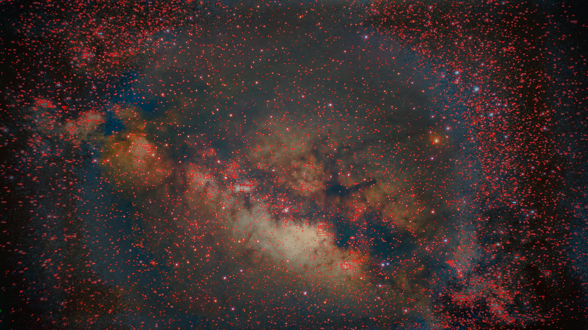

# DeepStack

(The image in the example dir is taken by me with a raspberry pi 3b+. For more info, check [this repo](https://github.com/n3rdium/AstroPi) out!)
A cross platform deep-sky image stacking program written in python. Built to be fast yet accurate, and user-friendly yet advanced and easily extensible.

This is going to be like N.I.N.A, except it's not for image acquisition, but for the preprocessing, stacking, and post-processing.
It will have a GUI and a CLI, and will be cross-platform.
It'll also have a blender-style processing automation planner.

What's really cool is that you can extend DeepStack yourself! It's extremely modular and easily modifiable, assuming that you know python.
Don't forget to open a PR if you do make something cool!
